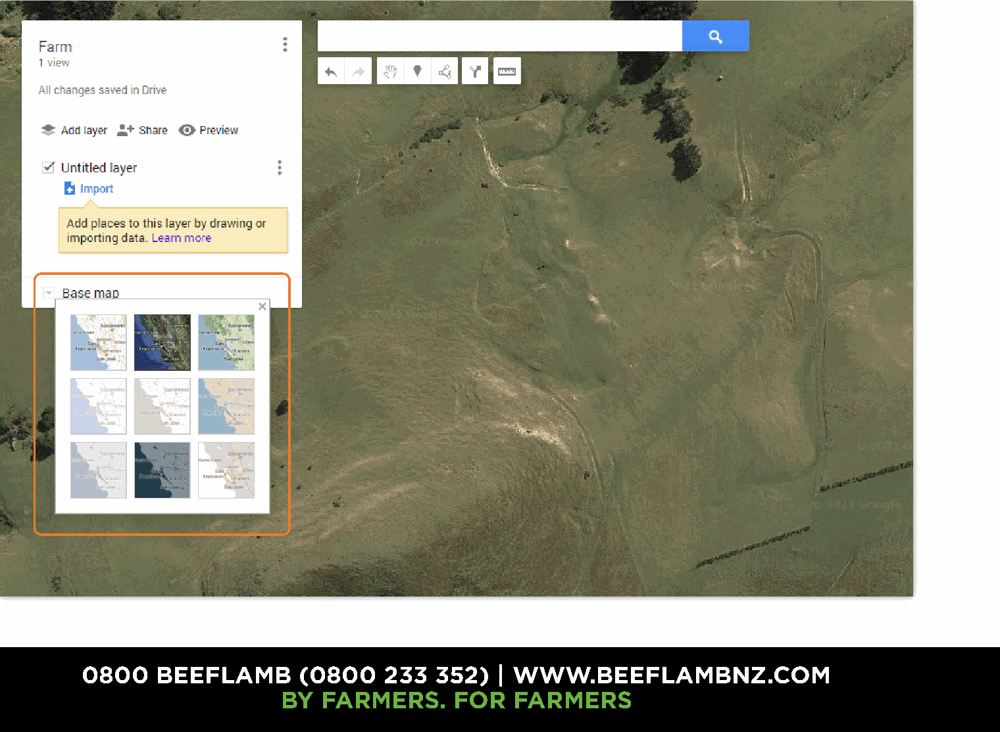
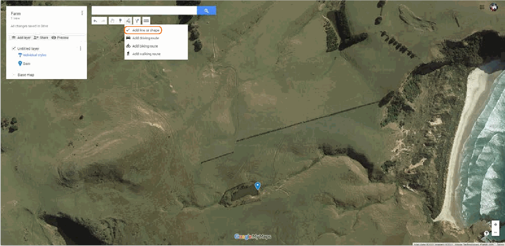

## Homework Instructions

In this homework assignment, you will create a PDF map of the school farm using Google My Maps. Use the class guide in [farm/index.Rmd](../index.Rmd) for full instructions. Follow the steps below to complete your task.

### Step 1: Create Your Map

1. Go to https://www.google.co.nz/mymaps and sign in to your Google account.
2. Create a new map and name it "Kaikorai Valley College School Farm".
3. Set up two layers:
   - **Existing** for current features (paddocks, dams, fences, buildings, water points).
   - **Proposed** for planned work (new planting, new fencing, new water lines).
4. Add features using the toolbar:
   - **Markers** for points (sheds, tanks, troughs, gates).
   - **Lines** for fences, tracks, or waterways.
   - **Areas** for paddocks or blocks.
5. Use the **Measurement tool** (ruler icon) to check at least one distance and one paddock area.
6. Add these map elements:
   - **Arrow (north)** for direction.
   - **Scale** to show distances.
   - **Legend** that explains your symbols and colors.

### Step 2: Export Your Map

Once you have completed your map, export it as a PDF. To do this:
1. Click the three vertical dots next to the map name.
2. Select **"Print map"** and choose the PDF option.

### Step 3: Quick Reference (Screenshots)

Use these images as a guide while you work.

**Layers and map setup**

{width=90%}

**Add markers and lines**

{width=90%}

{width=90%}

**Measurement tool**

{width=90%}

**Print map to PDF**

{width=90%}

### Step 4: Answer the Questions

After completing your map, please answer the following questions:

1. **What features did you include on your map, and why did you choose them?**
   
2. **How does adding a scale and legend enhance the usability of your map?**

### Curriculum Links

This homework aligns with the following New Zealand Curriculum areas:

- **Geography:** Understand how people interact with their environment.
- **Mathematics:** Use measurement and scale in practical contexts.

For more information, visit the New Zealand Curriculum website: [New Zealand Curriculum](https://curriculum.govt.nz/).

---

Make sure to submit your completed homework by the due date. Happy mapping!