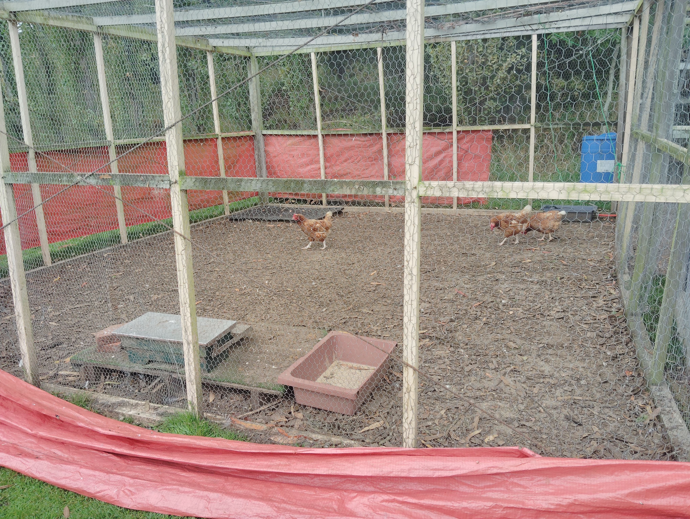

## About these units

The farm missions have been expanded into full practical units so they can be used as stand-alone learning activities. Each unit includes background information, safety guidance, clear steps, reflection prompts, and a simple way to record observations.

These units help students connect practical farm work with responsibility, sustainability, and scientific observation.

{width=48%}
{width=48%}

---

## Available units

### Unit 1: Animal Care and Observation

**Focus:** chickens, paddock animals, and welfare checks

{width=55%}

Students learn how to care for animals safely, observe changes in behaviour, and record welfare information.

[Open Unit 1](../unit-1-animal-care.qmd)

---

### Unit 2: Garden and Berry House Maintenance

**Focus:** watering, weeding, mulching, and seedlings

{width=55%}

Students maintain garden beds, berry plants, and young seedlings while learning practical horticultural care.

[Open Unit 2](../unit-2-garden-maintenance.qmd)

---

### Unit 3: Restoration and Tree Health

**Focus:** invasive weed control and native tree care

{width=55%}

Students investigate how restoration work supports biodiversity and long-term environmental health.

[Open Unit 3](../unit-3-restoration.qmd)

---

### Unit 4: Environmental Observation

**Focus:** streams, pollinators, and biodiversity monitoring

{width=55%}

Students make observations about the natural environment and build skills in careful recording and analysis.

[Open Unit 4](../unit-4-environmental-observation.qmd)

---

### Unit 5: Organisation and Inventory

**Focus:** tools, storage, safety, and workspace management

{width=55%}

Students learn how good organisation improves safety, tool care, and the effectiveness of farm work.

[Open Unit 5](../unit-5-organisation.qmd)

---

## How to use these units

1. Read the overview and learning goals before starting.
2. Gather the equipment listed in the unit.
3. Follow the safety notes carefully.
4. Complete the tasks in order.
5. Record observations and reflect on what you learned.
6. Report concerns or unusual findings to the supervisor.

---

## Mission philosophy

> Leave the farm better than you found it.

These units are designed to be:

- practical
- achievable in a reasonable time
- connected to real farm care
- useful for building environmental awareness
- safe when instructions are followed

---

## Ready to begin?

Choose a unit above and start contributing to the farm community with care and attention.
