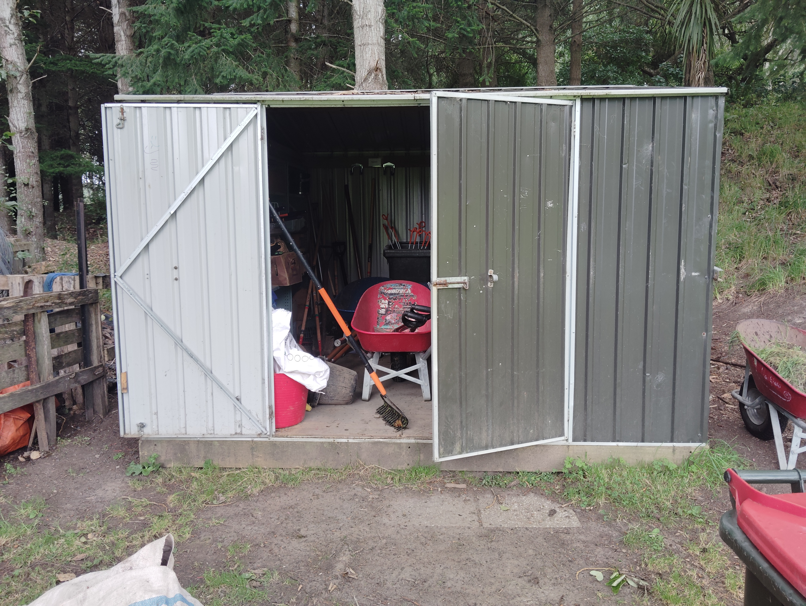

## Overview

This unit focuses on keeping the garden and berry house productive and healthy. Students learn that good crop care is a combination of observation, timing, and gentle practical work. Healthy soils, clean beds, and careful watering all contribute to strong plant growth.

## Why this matters

Plants grow best when their basic needs are met consistently. Weeds compete for water and nutrients, poor watering can stress plants, and neglected seedlings can struggle to establish. By caring for the garden regularly, students support food production and learn sustainable horticultural practices.

## Learning goals

By the end of this unit, students will be able to:

- explain why watering, weeding, and mulching matter;
- identify healthy versus stressed plants;
- care for seedlings safely and gently;
- use basic horticulture tools responsibly;
- record garden observations clearly.

## Equipment

- gloves
- trowel or fork
- watering can or hose
- wheelbarrow
- mulch or wood chips
- notebook

## Before you start

- Check the weather before watering.
- Avoid walking on wet soil where possible.
- Remove weeds carefully so you do not disturb crop roots.
- Ask for help if you are unsure which plants are crops and which are weeds.

## Task 1: Watering run

{width=60%}

Proper watering is essential for plant health:

- [ ] Use the blue bin supply to fill watering cans.
- [ ] Deliver at least two full cans per raised bed.
- [ ] Water the herb boxes by the barn if needed.
- [ ] Water at the base of plants rather than over leaves.
- [ ] Check soil moisture first; it should be damp but not soggy.

### Watering tips

- Water early in the morning or late in the afternoon when possible.
- Seedlings need gentle watering so they are not displaced.
- Different plants need different amounts; observe and adjust.

## Task 2: Weed and tend the beds

Keep garden beds healthy and productive:

- [ ] Collect gloves, a fork, and a wheelbarrow.
- [ ] Remove weeds from vegetable beds and no-dig beds.
- [ ] Gently aerate the topsoil if needed.
- [ ] Remove dead or diseased plant material.
- [ ] Check plants for pests, wilting, or poor growth.

### Good weed control practice

- Pull weeds from the root.
- Avoid disturbing crop roots.
- Add weeds to the compost pile if they are not seeding.

## Task 3: Care for the berry house

{width=55%}

Maintain the berry house for healthy fruit production:

- [ ] Weed around the base of the berry plants.
- [ ] Apply a fresh layer of wood chips to suppress weeds and hold moisture.
- [ ] Check berry plants for fruit development.
- [ ] Remove dead canes or leaves carefully.
- [ ] Make sure plants are still supported and not tangled.

### Berry care notes

- Keep mulch slightly away from stems.
- Monitor for disease or pest damage.
- Healthy berry plants usually show strong growth and good leaf colour.

## Task 4: Seedling care and propagation

Care for the next generation of plants:

- [ ] Check the seed raising tray in the tunnel house.
- [ ] Use a spray bottle to dampen the soil of emerging seedlings.
- [ ] Remove any failed seedlings.
- [ ] Transplant seedlings when they are ready.
- [ ] Label trays clearly.

### Seedling care reminder

- Keep soil moist but not waterlogged.
- Provide light and airflow.
- Watch for damping off disease and overcrowding.

## Observation log

After your work, record:

- what you watered
- which beds were weeded
- any new growth or plant stress
- any pests or disease noticed

## Reflection

1. Why does regular garden maintenance save time in the long run?
2. How could poor watering or too many weeds affect crop yields?
3. What signs suggest a plant is healthy or struggling?

## Extension

Design a simple garden care timetable for a week with tasks for watering, weeding, and checking seedlings.
