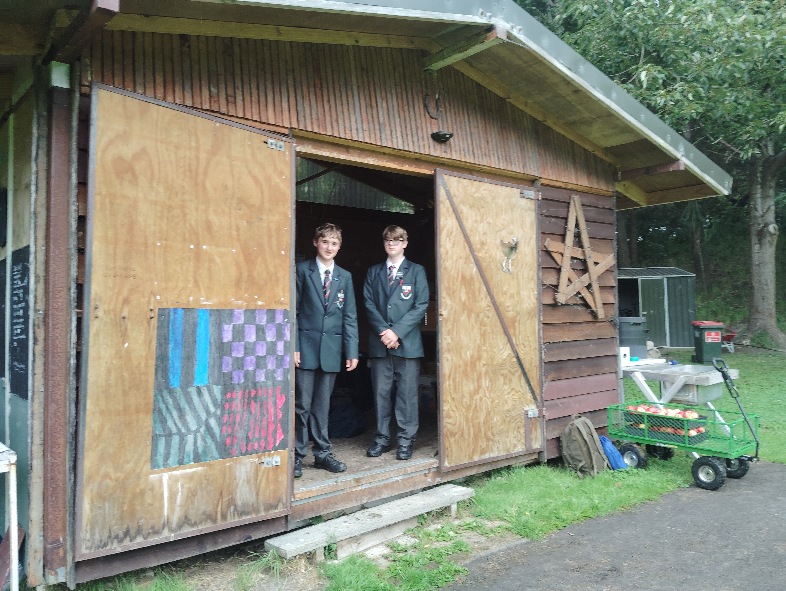
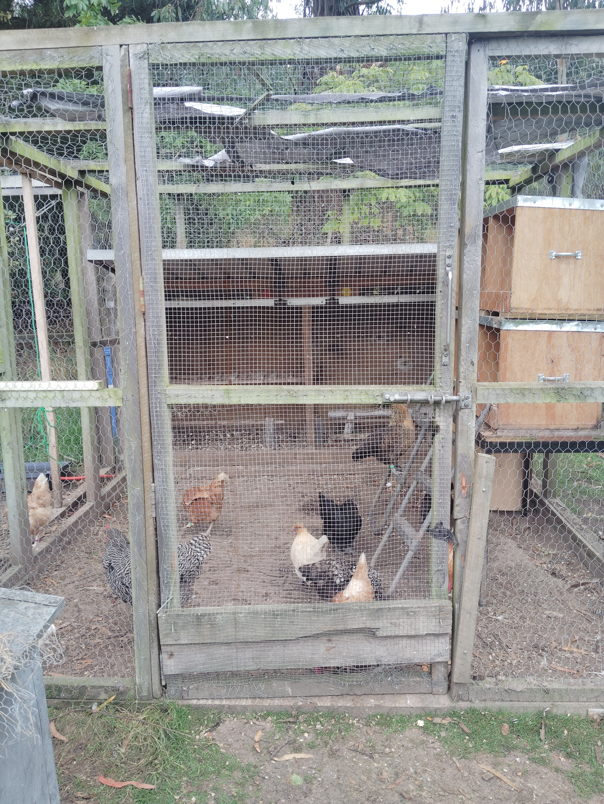
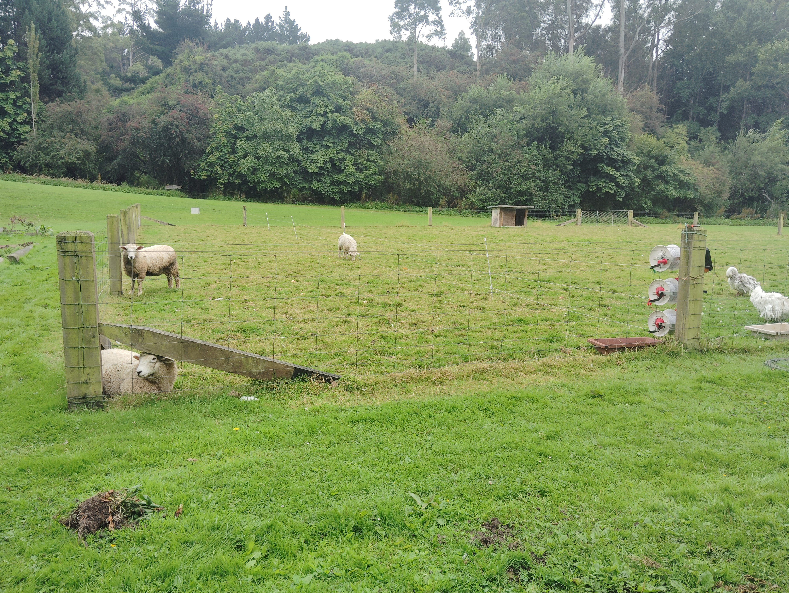
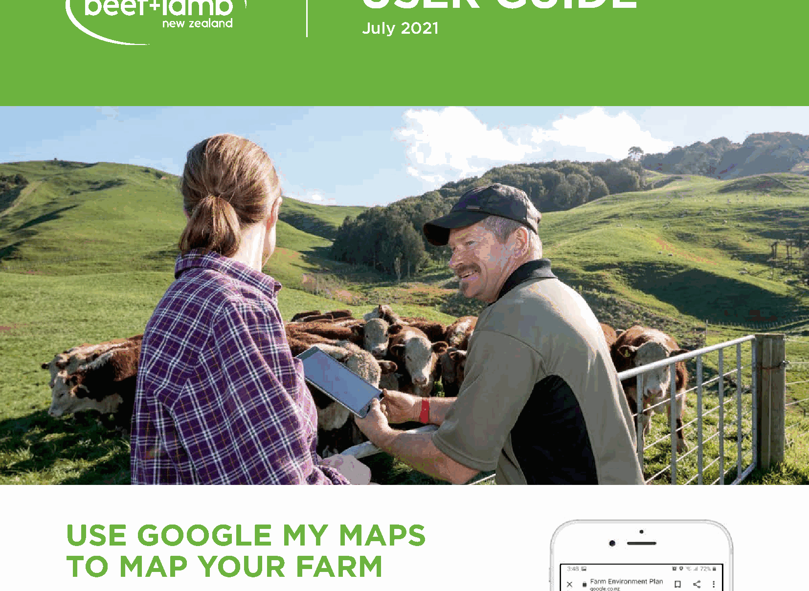
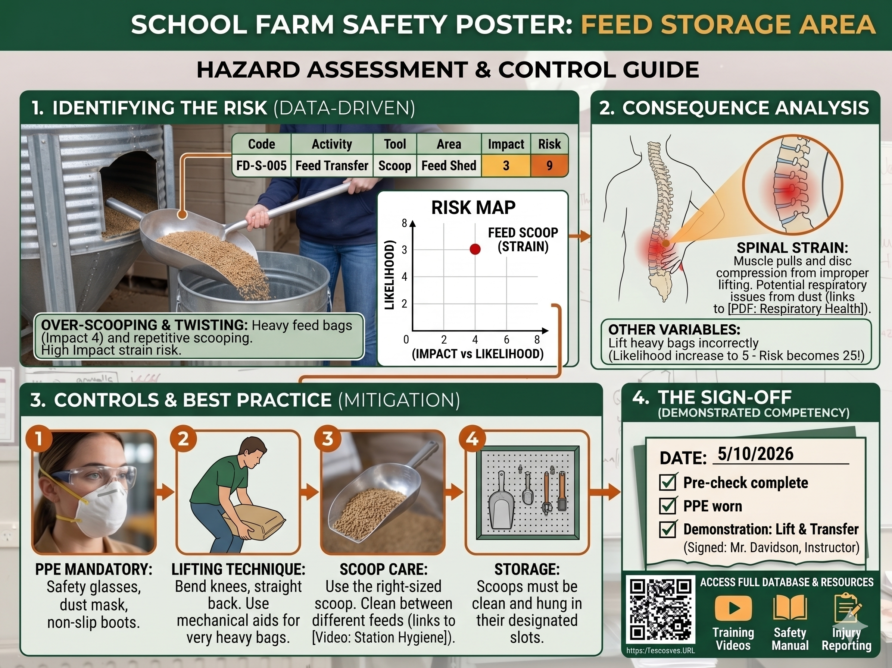
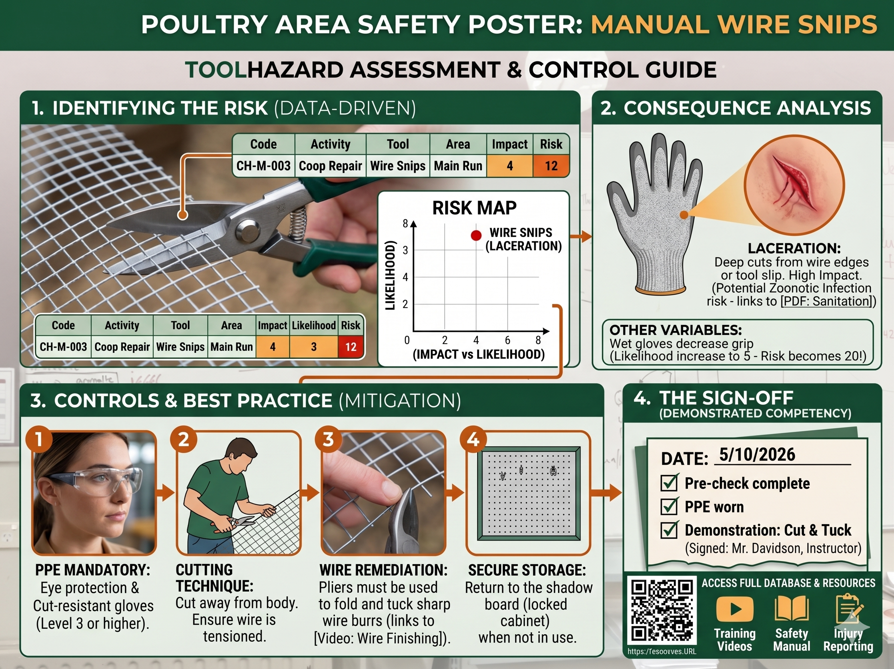

```{r setup, include=FALSE}
knitr::opts_chunk$set(echo = FALSE)

```

## Overview

This section contains the course sequence for the school farm programme. The structure is designed to run over three lessons per week across two terms, with a clear order: health and safety first, then school farm mapping, then the farm mission sequence, followed by independent practical units and projects.

This sequence supports both routine farm operations and longer specialist learning tasks, while keeping the course manageable for a 10-week term structure with a regular three-lesson rhythm.

## Course order

1. Health and safety induction and routines
2. School farm mapping and spatial planning
3. Core farm missions
4. Independent practical units and longer investigations

## Two-Term Unit Plan Calendar (Tue, Thu, Fri)

This class runs across two terms with three lessons each week:

- Term 1: 10 weeks (30 lessons)
- Term 2: 10 weeks (30 lessons)
- Class days: Tuesday, Thursday, Friday

### Term 1 Calendar (10 Weeks)

| Week | Tuesday | Thursday | Friday |
|---|---|---|---|
| 1 | Unit 1: Primary sectors in NZ | Unit 1: Sustainability and biodiversity | Unit 1: Rural safety and vocabulary |
| 2 | Unit 1: Location factors | Unit 1: Sector case studies | Unit 1: Quiz and safety practical |
| 3 | Unit 2: Intro to farm mapping | Unit 2: Base map and layers setup | Unit 2: Mapping field walk |
| 4 | Unit 2: Measuring paddock areas | Unit 2: Distance and scale calculations | Unit 2: Data entry and map updates |
| 5 | Unit 2: Proposed farm improvements | Unit 2: Final map formatting | Unit 2: Export and submit final map |
| 6 | Unit 3: Hazard identification | Unit 3: Tool safety and procedures | Unit 3: Potato patch prep practical |
| 7 | Unit 4: Working dogs and welfare | Unit 4: Sheep movement observation | Mission rotation and reflection |
| 8 | Unit 5: Apple harvest and handling | Unit 5: Weighing, bagging, and money maths | Farm mission + Friday close-down routine |
| 9 | Unit 6: Refractometer theory and setup | Unit 6: Calibration and safe use | Unit 6: Brix testing practical |
| 10 | Unit 6: Data analysis and recommendations | Term 1 review and catch-up | End-of-term practical checkpoint |

### Term 2 Calendar (11 Weeks)

| Week | Tuesday | Thursday | Friday |
|---|---|---|---|
| 1 | Unit 7: Forecast tools and maps + hazards mini-check | Unit 7: Reading Dunedin and Kaikorai forecasts + PPE reminder | Weather log setup + hazards monitoring entry |
| 2 | Unit 7: Forecast vs observed conditions + hazard spotting | Unit 7: Wind/rain impacts + control options | Farm weather reflection + risk ranking |
| 3 | Unit 7: Native vs invasive impacts + safe movement | Unit 7: Welfare planning + tool hazard cue | Air quality monitoring + evidence logging |
| 4 | Unit 8: Autumn crop selection + setup risk check | Unit 8: Germination planning + hygiene control | Seed sowing practical + safe workflow review |
| 5 | Unit 8: Tray management + manual handling cue | Mission 1 + animal area hazard focus | Friday close-down + weekly hazard log |
| 6 | Mission 2 + slips/trips and tool handling | Mission 3 + restoration safety controls | Mission evidence collection + hazard update |
| 7 | Mission 4 + environmental hazard cue | Mission 5 + organisation and safe storage | Mission catch-up + near-miss discussion |
| 8 | Integrated maths project + pre-task risk check | Data collection + control hierarchy review | Project work + monitoring log quality check |
| 9 | Project analysis + communication risk prompt | Recommendations + practical control planning | Farm operations practical + audit evidence |
| 10 | Report drafting + sign-off checklist | Presentation prep + peer safety feedback | Rehearsals + final hazard poster edits |
| 11 | Final presentations + hazard summary | Course reflection + behavior change review | End-of-term close-down + project sign-off |

### Farm Photo Highlights

Use these real farm snapshots as lesson starters, discussion prompts, and writing tasks.

{width=48%}
{width=48%}

{width=48%}
{width=48%}

{width=65%}

---

## Unit 1: Sector and Safety

Focus on the structure of New Zealand's primary industries, sustainability, location factors, rural safety, and introductory agricultural science vocabulary.

**What you'll do**

- Learn the seven key primary sectors in New Zealand.
- Explore sustainability, biodiversity, and resource management.
- Study why industries are located in different regions.
- Practise rural safety knowledge and agricultural science vocabulary.

- Go to: [Unit 1: Sector and Safety](sector-and-safety.qmd)

---

## Unit 2: Mapping the School Farm (3 weeks)

Focus on mapping the farm, measuring areas and distances, and producing a final map for the workbook.

{width=70%}

**What you'll do**

- Build layers for existing and proposed features.
- Measure paddocks and distances.
- Export a clean PDF map for your workbook.

- Go to: [Unit 2: Mapping the School Farm](mapping.qmd)

---

## Unit 3: Potato Patch Prep (3 lessons)

Focus on hazards, tool safety, and practical preparation of the potato patch.

**What you'll do**

- Identify hazards and agree on controls.
- Turn over soil and remove turf.
- Compost and level the patch for planting.

- Go to: [Unit 3: Potato Patch Prep](potato-patch.qmd)

---

## Unit 4: Farm Dogs & Working with Sheep (2 lessons)

Focus on the role of working dogs in livestock movement, animal welfare, and farm safety.

{width=60%}

**What you'll do**

- Learn how farm dogs support sheep and paddock operations.
- Practise observation and command-response analysis.
- Complete a practical lesson with Jess the sheepdog.

- Go to: [Unit 4: Farm Dogs & Working with Sheep](farm-dogs.qmd)

---

## Unit 5: Apple Unit (2 lessons)

Focus on harvesting, cleaning, weighing, and bagging apples for sale while applying measurement and money maths.

{width=60%}

**What you'll do**

- Pick and handle fruit safely.
- Clean and sort apples by quality.
- Weigh fruit accurately and pack sale bags.
- Calculate total expected income from packed fruit.

- Go to: [Unit 5: Apple Unit](apple-unit.qmd)

---

## Unit 6: Refractometer Testing - Sugar Levels in Farm Produce (4 lessons)

Focus on measuring sugar levels (Brix) in fruit and vegetables from around the farm using a refractometer.

**What you'll do**

- Learn how light refraction is used in practical farm testing.
- Calibrate and use a refractometer safely.
- Test and compare produce quality using Brix readings.
- Make evidence-based recommendations for harvest timing and crop quality.

- Go to: [Unit 6: Refractometer Testing](refractometer-unit.qmd)

---

## Unit 7: Weather, Forecasting, and Environmental Impacts (Dunedin and Kaikorai Valley)

Focus on reading local forecasts, interpreting conditions in Kaikorai Valley, and evaluating impacts on native and invasive species, animals and plants, with air quality monitoring integrated from current KVC practice.

**What you'll do**

- Track daily forecasts and compare forecast vs observed conditions.
- Assess weather impacts on native versus invasive species.
- Compare animal welfare impacts with plant growth and stress impacts.
- Use KVC air quality observations as part of farm risk planning.

- Go to: [Unit 7: Weather, Forecasting, and Environmental Impacts](weather-dunedin-kaikorai.qmd)

---

## Unit 8: Autumn Planting (Seedlings) (3 lessons)

Focus on choosing hardy autumn crops, sowing seeds accurately, and caring for seedlings before transplanting.

**What you'll do**

- Compare cool-season crops for Otago conditions.
- Learn how water, oxygen, and temperature support germination.
- Sow, label, and record trays correctly.
- Plan how to harden off seedlings before planting out.

- Go to: [Unit 8: Autumn Planting (Seedlings)](autumn-planting-seedlings.qmd)

---

## Unit 9: Farm Hazards and Safety Project (4-6 lessons)

Focus on completing a real farm hazard audit, developing controls, and presenting a student-designed safety communication poster.

{width=48%}
{width=48%}

**What you'll do**

- Complete hazard identification and risk scoring in a selected farm area.
- Build practical controls and safer work routines.
- Use templates to design a hazard communication poster.
- Present findings and recommendations to peers.

- Go to: [Unit 9: Farm Hazards and Safety Project](hazards-unit.qmd)

---

## Unit 10: Kaitiakitanga and Kōura (7 weeks)

Focus on freshwater crayfish, stream ecology, field observation, and practical stewardship through a local waterway investigation.

**What you'll do**

- Learn why kōura are culturally and ecologically important.
- Measure orbit-carapace length and record field observations.
- Compare shaded and open stream habitats.
- Use simple data tables and graphs to explain findings.
- Develop a recommendation for improving stream health and kaitiakitanga.

- Go to: [Unit 10: Kaitiakitanga and Kōura](koura-unit.qmd)
- Student worksheet: [Kōura Investigation Worksheet](koura-worksheet.qmd)
- Homework: [Kōura Homework Task](koura-homework.qmd)

---

## Farm Operations

### Farm Hazards and Safety

Student project resources and templates for the end-of-term hazard audit and safety poster task.

- Go to: [Unit 9 Hazards Project Hub](hazards-unit.qmd)

### Farm Tools and Equipment

Tool-related examples and resources are included inside the hazards project unit for classroom use.

- Go to: [Hazards Unit Resources](hazards-unit.qmd)


### Farm Missions

Regular maintenance and care tasks that anyone can undertake. Each mission focuses on a specific area of farm management with detailed instructions and ticklists.

{width=48%}
{width=48%}

**Available Missions:**

- Mission 1: Animal Care & Observation
- Mission 2: Garden & Berry House Maintenance
- Mission 3: Restoration & Tree Health
- Mission 4: Environmental Observation
- Mission 5: Organisation & Inventory

- Go to: [Farm Missions Overview](unit-missions-index.qmd)

---

### Friday Close-Down Checklist

A quick final check for Friday afternoon to ensure the farm is secure, clean, and ready for the weekend.

**What you'll do**

- Verify all animals have weekend supplies
- Confirm tools and equipment are secured
- Check gates, doors, and utilities
- Ensure the farm is ready for Monday

- Go to: [Friday Close-Down Checklist](friday-closedown.qmd)